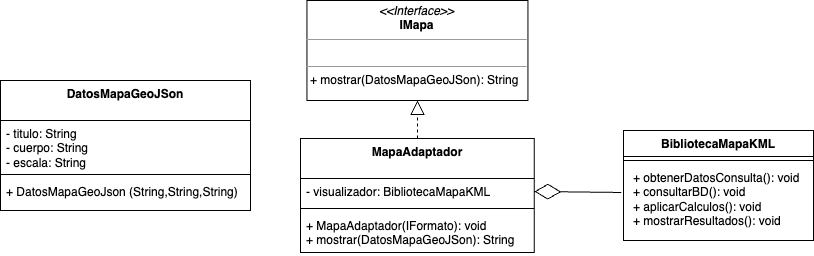

# Problema 2
## Problema: Integración de Biblioteca Incompatible

La integración de una biblioteca de terceros con una interfaz incompatible en tu sistema
existente.

L@ llamaron para desarrollar una aplicación que procesa datos geográficos y utiliza una
biblioteca de terceros para mostrar mapas en formato KML (Keyhole Markup Language). Sin
embargo, tu sistema ya está diseñado para trabajar con datos en formato GeoJSON. La
biblioteca de terceros solo admite KML, pero necesitas que tu aplicación funcione con datos
GeoJSON sin modificar toda la lógica existente.

Tu solución debe permitir integrar componentes incompatibles al proporcionar una interfaz
uniforme y una capa de adaptación entre ellos.

# Justificación

Se eligió el patrón de estructural “**Adapter**”:

Para abordar el tema de la biblioteca de terceros con una interfaz incompatible de un tercero,
se emplea este patrón para resolver la interoperabilidad entre la librería incompatible y la lógica que se espera lograr,
permitiendo que ambas funcionen teniendo una interfaz común, con sus adaptaciones,
logrando facilitar la conversión de datos del GeoJson al XML interpreta en KML, evitando alterar la lógica existente.

# Diagrama

# Referencias

1. https://refactoring.guru/es/design-patterns/catalog
2. https://developers.google.com/kml/documentation/kml_tut?hl=es#:~:text=KML%20es%20un%20formato%20de,basado%20en%20el%20est%C3%A1ndar%20XML.
3. https://mygeodata.cloud/

