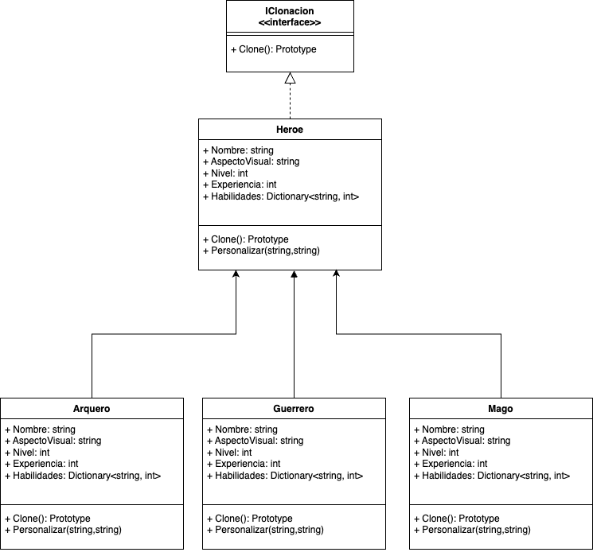

# Problema 3
## Problema: Clonación de Personajes en un Videojuego de Aventuras

Imagina que estás desarrollando un videojuego de aventuras en el que los jugadores
pueden controlar a un grupo de héroes con habilidades únicas. Necesitas implementar un
sistema de clonación de personajes. Los jugadores deben poder clonar y personalizar
héroes existentes para formar equipos estratégicos.

## Requerimientos del sistema:

1. Los jugadores deben poder clonar a los héroes existentes en el juego para crear nuevos personajes con habilidades idénticas.
2. Cada héroe tiene un conjunto único de habilidades especiales que incluyen ataques, defensas y habilidades mágicas.
3. Los héroes pueden pertenecer a diferentes clases, como guerreros, magos o arqueros, y cada clase tiene su propio conjunto de habilidades base.
4. Los jugadores deben poder personalizar los nombres y aspectos visuales de los héroes clonados después de la clonación.
5. Los héroes deben mantener un registro de su experiencia, nivel y puntos de habilidad, y esta información debe copiarse correctamente al clonar un héroe.
6. El sistema debe ser eficiente y permitir la creación de múltiples clones de un mismo héroe sin duplicar innecesariamente los datos.

# Justificación

Se eligió el patrón de creacional “**Prototype**”:

Nos centramos en abordar la problemática con el patrón principal (Prototype), 
que nos permitió desarrollarlo de una manera más rápida y fue altamente efectiva para solucionar la clonación sin agregarle complejidad al código y haciéndolo más legible,
por lo tanto más fácil de entender, cumpliendo con las características solicitadas, sin embargo, 
si los requerimientos tuvieran una mayor complejidad lo que seria necesario agregar más de un patrón para solucionar la problemática
como lo son los patrones de Comportamiento o patrones Estructurales para relacionar objetos de una manera más flexible. 
Un ejemplo puede ser la interacción de objetos clonados con objetos del juego como las armas

# Diagrama

# Referencias

1. https://refactoring.guru/es/design-patterns/catalog

